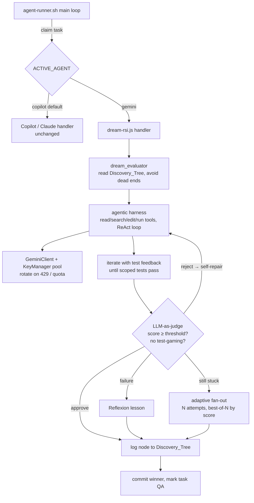

# Gemini Dream-RSI Engine

A 24/7 autonomous engine for the Waymark dev-worker. It runs a **rotating
Gemini API-key pool** and an **adaptive Dream-RSI (Recursive Self-Improvement)
loop** that uses a Google Sheet as its long-term memory. It sits behind a
modular **agent router** so you can swap it in for the existing Copilot worker
with a single environment variable — and it lays the groundwork for the future
V2 multi-agent system.

> The existing Copilot / Claude worker is **untouched**. `ACTIVE_AGENT=copilot`
> (the default) keeps everything exactly as it was.

---

## How it fits together



| Piece | File |
|---|---|
| Engine router | [dev-worker/scripts/agent-runner.sh](../dev-worker/scripts/agent-runner.sh) |
| Key pool + rotation | [dev-worker/scripts/key-manager.js](../dev-worker/scripts/key-manager.js) |
| Gemini API client | [dev-worker/scripts/lib/gemini.js](../dev-worker/scripts/lib/gemini.js) |
| Agentic coding harness | [dev-worker/scripts/lib/agent-harness.js](../dev-worker/scripts/lib/agent-harness.js) |
| Self-judging evaluator | [dev-worker/scripts/lib/evaluator.js](../dev-worker/scripts/lib/evaluator.js) |
| Zero-dep Sheets client | [dev-worker/scripts/lib/sheets.js](../dev-worker/scripts/lib/sheets.js) |
| Discovery Tree + dream_evaluator | [dev-worker/scripts/discovery-tree.js](../dev-worker/scripts/discovery-tree.js) |
| Dream-RSI handler | [dev-worker/scripts/dream-rsi.js](../dev-worker/scripts/dream-rsi.js) |
| Unit tests | [dev-worker/tests/dream-rsi.test.js](../dev-worker/tests/dream-rsi.test.js) |

---

## What you need to do to get it running

### 1. Get a pool of Gemini API keys

Each Google account can mint a free Gemini API key. The pool is what gives you
24/7 uptime: when one key hits its rate limit, the loop parks it for an hour and
rotates to the next.

1. Go to <https://aistudio.google.com/app/apikey>.
2. Create an API key (repeat under different Google accounts for a bigger pool).
3. Collect the keys — you'll paste them comma-separated on one line.

> 3–5 keys is a comfortable starting pool. More keys = more continuous throughput.

### 2. Configure `.env`

Copy the example if you haven't already, then fill in the Gemini section:

```bash
cp .env.example .env
```

Set these in `.env`:

```bash
# Switch the worker to the Gemini engine
ACTIVE_AGENT=gemini

# Your rotating key pool — comma-separated, ONE line
GEMINI_KEY_POOL=AIzaKEY1,AIzaKEY2,AIzaKEY3

# Model (default shown)
GEMINI_MODEL=gemini-flash-latest

# The workboard the agent polls for tasks. The Discovery_Tree memory tab is
# auto-created inside this same sheet unless you set DISCOVERY_TREE_SHEET_ID.
WAYMARK_WORKBOARD_ID=1Jl-fmWVEGatzOORp4wPQwPpg78binoBlCWATP9xb_q4
```

Optional tuning (sensible defaults apply if omitted):

```bash
GEMINI_KEY_COOLDOWN_MS=3600000     # per-key cooldown after a 429 (1 hour)
DISCOVERY_TREE_SHEET_ID=           # separate sheet for memory (default: workboard)
DISCOVERY_TREE_TAB=Discovery_Tree  # tab name
DREAM_FANOUT_N=3                   # parallel agentic attempts when a task keeps failing
DREAM_MAX_TURNS=24                 # max tool actions per attempt
DREAM_TEST_TIMEOUT_MS=600000       # max time per test run (10 min)
DREAM_EVAL_ENABLED=1               # LLM-as-judge gate (set 0 to disable)
DREAM_EVAL_THRESHOLD=0.7           # minimum review score to accept an attempt
DREAM_EVAL_RETRIES=1               # self-repair rounds on a rejected attempt
DREAM_PUSH=1                       # push winning branches to origin for QA
```

### 3. Confirm the Google service-account key

The Sheets memory uses the same service-account key the rest of the dev-worker
uses. Make sure it exists on the host (mounted into the container at
`/credentials/gsa-key.json`):

```bash
ls -l "$HOME/.config/gcloud/waymark-service-account-key.json"
```

The service account must have **edit** access to the workboard / Discovery_Tree
sheet (share the sheet with the SA's `client_email`).

### 4. Start the Gemini worker

```bash
make gemini-start
```

This builds and starts one container running the Dream-RSI loop. Give it a name
if you like:

```bash
make gemini-start NAME=Gemini
```

### 5. Watch it work

```bash
make gemini-logs
```

You should see the engine boot, report the key-pool size, run `dream_evaluator`,
call Gemini, run tests, and update the workboard. On first run it auto-creates
the `Discovery_Tree` tab in your sheet.

### 6. Verify the memory

Open your workboard sheet in the Waymark UI (or Google Sheets). A new
**Discovery_Tree** tab will appear, with one row per Gemini attempt:

| Timestamp | Branch ID | Parent ID | Task Row | Task | Prompt | Status | Tests | Result | Key Index | Score |
|---|---|---|---|---|---|---|---|---|---|---|

That's the full run: **works + tested + logged.** Stop the worker any time with
`make agent-stop`.

---

## How the loop works

1. **Claim** — the shared `agent-runner.sh` loop claims the next workboard task
   (same claiming logic the Copilot worker uses).
2. **dream_evaluator** — before writing any code, `discovery-tree.js` reads the
   `Discovery_Tree`, isolates prior attempts for this task, and returns the set
   of **dead ends to avoid** plus a recommendation on whether to fan out.
3. **Solve (agentic harness)** — `agent-harness.js` drives Gemini as a real
   coding agent: it explores the repo and edits it through tools
   (`read_file`, `search`, `edit_file`, `write_file`, `run`), one action per
   turn, pulling each turn's API key from the pool. On HTTP 429 /
   `RESOURCE_EXHAUSTED` it rotates keys and continues mid-episode.
4. **Verify + fix** — the agent runs the scoped tests; `finish` re-runs the test
   command and, if it fails, the failure is fed back so the agent self-corrects
   (the lint/test → fix loop). The episode ends only when tests pass or the turn
   budget is spent.
5. **Evaluate (self-judge)** — once tests pass, an **LLM-as-judge** scores the
   change against a rubric and explicitly checks for **test gaming**. The
   attempt is accepted only if it clears `DREAM_EVAL_THRESHOLD`; otherwise the
   judge's issues are fed back for a self-repair round.
6. **Adapt (adaptive compute)** — if a task keeps failing, the engine **fans
   out**: it runs `DREAM_FANOUT_N` full agentic attempts in parallel across
   different keys in isolated `git worktree`s, judges each, merges the
   **highest-scoring** winner, and logs every dead end. Each failed attempt also
   produces a one-line **Reflexion** lesson that becomes an explicit "avoid".
7. **Record** — every attempt becomes a node in the `Discovery_Tree`; on success
   the task moves to **QA** with a note describing how to verify it.

### The agentic harness

The engine is a genuine coding harness, not a single-shot generator. Its design
borrows directly from the leading open-source coding agents:

| Technique | Borrowed from | How it shows up here |
|---|---|---|
| Agent-Computer Interface (small, documented tool set) | **SWE-agent** | `read_file`/`search`/`edit_file`/`write_file`/`run`/`finish` with structured observations |
| Precise SEARCH/REPLACE edits + repo map | **Aider** | `edit_file` requires an exact, unique match; a compact repo map orients turn one |
| Event/observation loop | **OpenHands** | every turn is `{thought, tool, args}` → observation → next action (ReAct) |
| Lint / test → fix loop | SWE-agent / Aider | JS edits get an instant `node --check`; a failing `finish` re-runs tests and keeps going |
| Self-reflection on failure | **Reflexion** | each dead end is distilled to a one-line lesson fed into the next attempt |

**Guardrails baked in:** every file path is confined to the workspace (no
traversal), `run` blocks destructive/`git push` commands and is time-bounded, and
the turn budget (`DREAM_MAX_TURNS`) caps each episode.

### The self-judging eval

Passing tests are necessary but not sufficient — an agent can make a suite go
green by gaming it. So once tests pass, an **LLM-as-judge**
([evaluator.js](../dev-worker/scripts/lib/evaluator.js)) reviews the diff + test
output and returns a structured verdict:

- a **0–1 score** across correctness, completeness, test quality, code quality,
  and Waymark-law compliance;
- an explicit **test-gaming** flag (deleted/weakened/skipped tests, trivial
  always-true assertions, tests edited to match buggy behavior);
- whether the change **actually fulfills the task**, plus concrete issues.

The loop uses the verdict three ways:

1. **Gate** — an attempt is accepted only if it passes tests *and* the judge
   approves (score ≥ `DREAM_EVAL_THRESHOLD`, no gaming). A rejected attempt is
   reverted and logged as a dead end.
2. **Self-repair** — on a rejected-but-passing attempt, the judge's issues are
   fed back to the harness for up to `DREAM_EVAL_RETRIES` fix-and-resubmit rounds.
3. **Best-of-N** — in fan-out, the judge scores every passing candidate and the
   **highest-scoring** one wins (not just the first to go green).

The review score is written to the Discovery_Tree `Score` column, so the memory
records not just pass/fail but *how good* each branch was. Set
`DREAM_EVAL_ENABLED=0` to fall back to a pure test-only gate.

### Key rotation

`KeyManager` (in `key-manager.js`) owns the pool:

- `getKey()` returns the active key, skipping any on cooldown.
- `rotateKey()` parks the current key for `GEMINI_KEY_COOLDOWN_MS` (default 1h)
  and advances to the next available key.
- When the whole pool is cooling down it reports `msUntilAvailable()` so the loop
  backs off instead of hammering the API.
- `status()` is safe to log — it **never** exposes raw key material.

---

## Swapping engines (V2 groundwork)

The router in `agent-runner.sh` reads `ACTIVE_AGENT` and dispatches through a
single `dispatch_session()` seam:

- `ACTIVE_AGENT=copilot` (default) → the existing `AI_PROVIDER` path
  (GitHub Copilot CLI or Claude Code). **Completely unchanged.**
- `ACTIVE_AGENT=gemini` → the Dream-RSI handler.

Adding a new engine later means adding one `run_<engine>` function and one
`case` arm — the loop, task-claiming, notes handling, and heartbeat are shared.
This is the structural foundation for running multiple engines side by side.

---

## Make targets

| Command | Does |
|---|---|
| `make gemini-start` | Build + start a worker on the Gemini Dream-RSI engine |
| `make gemini-logs` | Tail the worker output |
| `make agent-stop` | Stop the worker |
| `make dream-test` | Run the Dream-RSI unit tests (no network, no keys needed) |

---

## Testing

The engine ships with fast, offline unit tests. The clock and the Sheets backend
are injected, so the real key-rotation and dream_evaluator logic run without
touching Google or waiting for a cooldown:

```bash
make dream-test
```

---

## Troubleshooting

| Symptom | Fix |
|---|---|
| `GEMINI_KEY_POOL is empty` | Set `GEMINI_KEY_POOL` in `.env` (comma-separated, one line). |
| No `Discovery_Tree` tab appears | Share the sheet with the service-account `client_email` (edit access); confirm `WAYMARK_WORKBOARD_ID`. |
| Every call 429s immediately | Your keys are exhausted — add more keys to the pool or wait out the cooldown. |
| Worker runs but never pushes | Set `DREAM_PUSH=1` and ensure the container's SSH key can push to origin. |
| Tests never pass on a task | Check the `Discovery_Tree` — the dead-end log shows what each attempt tried and why it failed. |

---

## Security notes

- API keys live only in `.env` (git-ignored) and the container environment.
  They are never written to logs or the Discovery_Tree.
- Model-generated file writes are path-checked — a bad response can never escape
  the workspace directory.
- Failed attempts revert **only** the files the agent itself wrote; your
  unrelated working-tree changes are never touched.
